<div align="center">
  
</div>

<br />

# Academic Portfolio

This repository hosts a curated collection of Python scripts developed as part of the second-year programming curriculum. Each module is structured to demonstrate core concepts of Object-Oriented Programming (OOP), functional patterns, recursion, and system automation.

---

## Core Modules

### 1. Library Management System
* **Implementation:** [libmain.py](file:///Users/sarthakbhopale/Documents/Python/Python%202nd%20year/Github_uoload/libmain.py) & [activity_1.py](file:///Users/sarthakbhopale/Documents/Python/Python%202nd%20year/Github_uoload/activity_1.py)
* **Description:** A command-line program facilitating book cataloging, user registration, and transaction logging for borrowing and returning resources.

### 2. Academic Performance Report
* **Implementation:** [student_report.py](file:///Users/sarthakbhopale/Documents/Python/Python%202nd%20year/Github_uoload/student_report.py) & [assignment_2.py](file:///Users/sarthakbhopale/Documents/Python/Python%202nd%20year/Github_uoload/assignment_2.py)
* **Description:** An OOP-driven grades report generator featuring clean, structured console outputs wrapped in custom formatting decorators.

### 3. Advanced Decorators
* **Implementation:** [decorators.py](file:///Users/sarthakbhopale/Documents/Python/Python%202nd%20year/Github_uoload/decorators.py)
* **Description:** Practical implementations of reusable function wrappers, including execution loggers and access-control guards.

### 4. Mathematical Recursion
* **Implementation:** [activity_4.py](file:///Users/sarthakbhopale/Documents/Python/Python%202nd%20year/Github_uoload/activity_4.py)
* **Description:** An optimized Fibonacci computation module using memoization to guarantee O(N) linear time complexity.

---

## Execution Guide

To run any of the modules, execute the target file using Python 3:

```bash
python3 student_report.py
```

---

<div align="center">
  <sub>Submitted by <b>Sarthak</b> &bull; Python Coursework &bull; Second Year</sub>
</div>
