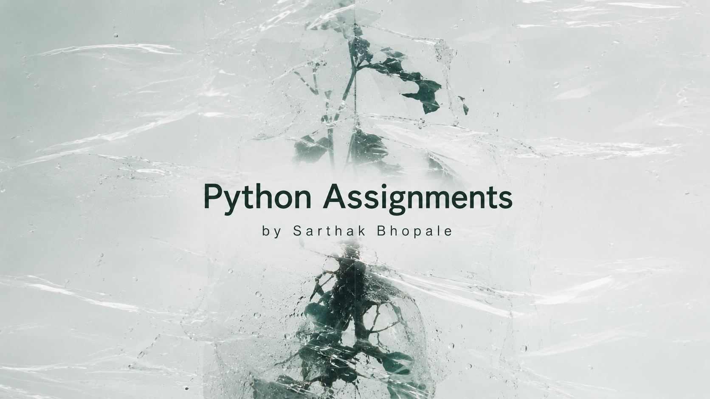

<div align="center">
  
</div>

<br />

<div align="center">

# About

This repository hosts a curated collection of Python scripts developed as part of the second-year programming curriculum. Each module is structured to demonstrate core concepts of Object-Oriented Programming (OOP), functional patterns, recursion, and system automation.

---


## Execution Guide

To run any of the modules, execute the target file using Python 3:

```bash
python3 name_of_the_file.py
```

---
</div>

<div align="center">
  <sub>Submitted by <b>Sarthak</b> &bull; Python Coursework &bull; Second Year</sub>
</div>

